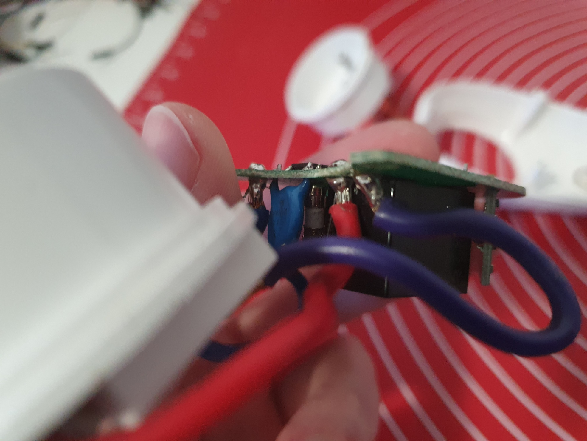
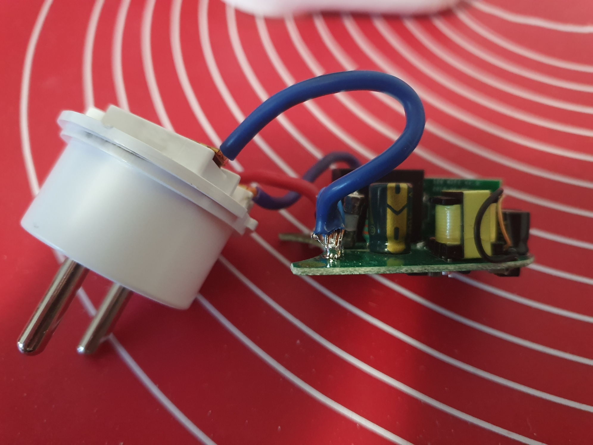
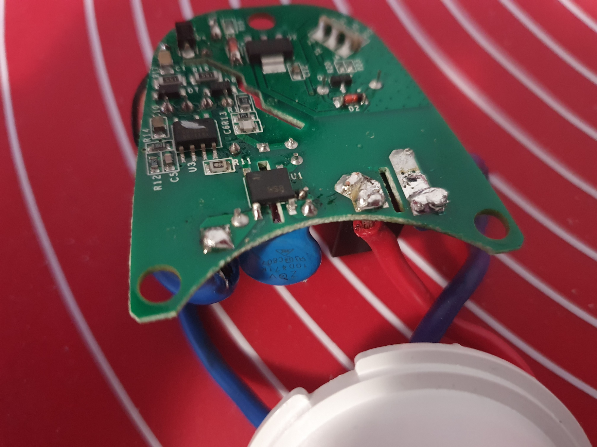

## The device

I bought a device called AISpeaker S26. In the picture, it looked very similar to Sonoff S26.
When I disassembled it, I found out I was right, it's just rebranded Sonoff S26 and the `S26` marker
in the name was not just a coincidence.
That also means that instructions in this post can be used for Sonoff.

## First impression

Right after took the PCB out, I noticed the wires aren't soldered very well, so the first thing
I had to do was to solder them properly.

The device also contains custom firmware. This does not bother me much,
since I wanted to re-flash the firmware anyway, so I would be able to connect it to my Home Assistant.

## Wiring

- [Odroid C4 pinout](https://wiki.odroid.com/odroid-c4/hardware/expansion_connectors)

|           | AISpeaker S26 | Odroid C4    |
|-----------|------------|--------------|
| Power     | 3.3V       | 3.3V (pin 1) |
| Ground    | GND        | GND (pin 6)  |
| UART      | ERX        | TX (pin 8)   |
| UART      | ETX        | RX (pin 10)  |
| Reset pin | J4         | GND          |


The RX and TX wires must be crossed, it's not a mistake.


## Install ESPHome

First, we need to create new Python virtual environment and then install esphome using `pip` module.
To do that, run the following commands on Odroid:


mkdir ~/esphome
cd ~/esphome

python3 -m venv .
source ./bin/activate
python3 -m pip install -U wheel setuptools pip
python3 -m pip install esphome


## Create ESP Home config

Create new file called `secrets.yaml` and set all necessary passwords and secrets:


# secrets.yaml
wifi_ssid: <Your WiFi network name>
wifi_password: <wifi_password>
api_password: <api_password>
api_encryption: <api_encryption_secret>
ota_password: <ota_password>


Example config ([source](https://www.esphome-devices.com/devices/Sonoff-S26)):


# aispeaker-s26.yaml
esphome:
  name: ai-speaker-s26
  platform: ESP8266
  board: esp01_1m
  board_flash_mode: dout

wifi:
  ssid: !secret wifi_ssid
  password: !secret wifi_password
  manual_ip:
    static_ip: 192.168.0.100
    gateway: 192.168.0.1
    subnet: 255.255.255.0

status_led:
  pin:
    number: GPIO13
    inverted: false
logger:

api:
  password: !secret api_password
  encryption:
    key: !secret api_encryption

ota:
  password: !secret ota_password

web_server:

binary_sensor:
  - platform: gpio
    pin:
      number: GPIO0
      mode: INPUT_PULLUP
      inverted: True
    name: "AISpeaker S26 - Button"
    on_press:
      - switch.toggle: relay
  - platform: status
    name: "AISpeaker S26 - Status"

sensor:
  - platform: wifi_signal
    name: "AISpeaker S26 - WiFi Signal"
    update_interval: 60s
switch:
  - platform: gpio
    name: "AISpeaker S26 - Relay"
    pin: GPIO12
    id: "relay"
  - platform: restart
    name: "AISpeaker S26 - Restart"


## Flashing the firmware

1. Connect the `ERX`, `ETX` and `GND` wires to correct pins on Odroid
1. Connect the `J4` pin to `GND` pin on Odroid
1. Connect the `3.3V` pin to `3.3V` pin on Odroid
1. If everything goes right, no LEDs should be blinking


If any LED blinks or lights on S26, the device booted to normal mode.
Disconnect the power and `J4` wires and repeat steps `2` and `3`.


On Odroid, compile and flash the firmware using
command `esphome run --device /dev/ttyAML1 aispeaker-s26.yaml`.

When the firmware is uploaded to the device, `esphome` will try to reset the device to the normal mode.
Unfortunately, this doesn't work so you have to reset the device manually. 
Just disconnect and reconnect the power wire (the 3.3V) to restart the device.
This time, `J4` pin must NOT be connected.

If everything goes well, you should see the firmware booting output in terminal.
